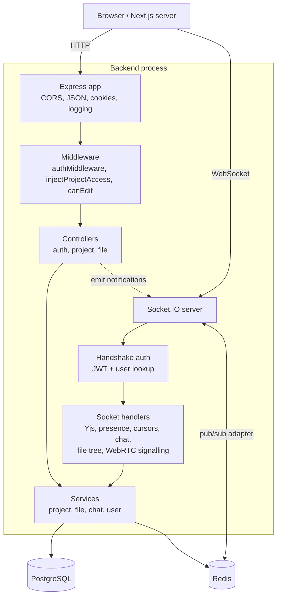

# SyncEdit Backend

REST API and real-time gateway for [SyncEdit](../README.md), a collaborative code editor. It handles authentication, project and file management, role-based access control, and the Socket.IO layer that powers live editing (Yjs), presence, chat and WebRTC signalling.


## Contents

- [Tech Stack](#tech-stack)
- [Architecture](#architecture)
- [Folder Structure](#folder-structure)
- [Authentication & Sessions](#authentication--sessions)
- [Authorization (RBAC)](#authorization-rbac)
- [Real-time Layer](#real-time-layer)
- [Data Layer](#data-layer)
- [Environment Variables](#environment-variables)
- [Running Locally](#running-locally)
- [Design Decisions & Trade-offs](#design-decisions--trade-offs)
- [Known Limitations & Hardening Roadmap](#known-limitations--hardening-roadmap)

## Tech Stack

| Concern            | Choice                                         |
| ------------------ | ---------------------------------------------- |
| Runtime / language | Bun, TypeScript                                |
| HTTP framework     | Express (`cors`, `cookie-parser`, `morgan`)    |
| Real-time          | Socket.IO, `@socket.io/redis-adapter`, Yjs     |
| Database           | PostgreSQL via `pg` (connection pool)          |
| Cache / pub-sub    | Redis via `ioredis`                            |
| Auth               | `jsonwebtoken`, `bcryptjs`, `httpOnly` cookies |
| Config             | `dotenv`                                       |

## Architecture



The code is layered so each concern has one home:

| Layer           | Responsibility                                                                   | Rule of thumb                     |
| --------------- | -------------------------------------------------------------------------------- | --------------------------------- |
| **Routes**      | Map URL + method to middleware and a controller                                  | No logic                          |
| **Middleware**  | Authentication, access-level injection, permission gates                         | Cross-cutting checks only         |
| **Controllers** | Parse and validate the request, shape the response, trigger socket notifications | No SQL                            |
| **Services**    | Business logic and all SQL / Redis access                                        | No `req` / `res`                  |
| **Sockets**     | Event handlers, in-memory room state                                             | Delegates persistence to services |

### Request lifecycle (protected route)

```
Request → cookie-parser → authMiddleware → injectProjectAccess → canEdit → controller → service → PostgreSQL / Redis
              │                  │               │                  │
              │                  │               │                  └─ 403 "Read-only access" if level < edit
              │                  │               └─ resolves projectId (param, body, or via file id) and the user's access level
              │                  └─ verifies JWT, checks the Redis blacklist, loads the user (401 otherwise)
              └─ reads the `token` cookie
```

## Folder Structure

```
backend/
├── postgresqlStructure.sql          # database schema
└── src/
    ├── server.ts                    # HTTP server, socket init, graceful shutdown
    ├── app.ts                       # Express app, CORS, routes, health, error handler
    ├── config/
    │   ├── env.ts                   # typed env access, JWT expiry constants
    │   └── db.ts                    # pg Pool (max 10, SSL optional, keep-alive)
    ├── lib/redis.ts                 # shared ioredis client
    ├── routes/                      # auth.routes, project.routes, file.routes
    ├── controllers/                 # auth, project, file
    ├── middlewares/
    │   ├── authMiddleware.ts        # JWT cookie -> req.user
    │   └── accessMiddleware.ts      # injectProjectAccess, canEdit
    ├── services/
    │   ├── project.service.ts       # projects, members, invites, access cache
    │   ├── file.service.ts          # file/folder CRUD, tree assembly
    │   ├── chat.service.ts          # persisted chat messages
    │   ├── userService.ts           # user lookup
    │   └── ProjectTreeService.ts    # in-memory per-project tree cache
    ├── sockets/
    │   ├── socket.ts                # Socket.IO setup, auth, Yjs, presence, chat, WebRTC
    │   └── fileTree.socket.ts       # live file-tree events
    ├── models/                      # TypeScript models (User, ...)
    ├── types/                       # Express request typing, file/tree types
    └── utils/
        ├── tokenManager.ts          # sign / verify / blacklist JWTs
        ├── permissions.ts           # role ranking and permission helpers
        ├── buildFileTree.ts         # flat rows -> nested tree
        └── asyncHandler.ts          # forwards async errors to Express
```

## Authentication & Sessions

- **Register:** passwords are hashed with `bcryptjs` (10 rounds). Only `id`, `name` and `email` are returned.
- **Login:** a JWT (`id`, `email`, 7-day expiry) is set in an **`httpOnly` cookie**. In production the cookie is `secure` and `SameSite=Strict`; in development it is `SameSite=Lax`.
- **Per request:** `authMiddleware` reads the cookie, verifies the signature, rejects blacklisted tokens, and re-loads the user from the database so deleted users are locked out immediately.
- **Logout:** the token is written to Redis as `blacklist:{token}` with a TTL equal to the token's _remaining_ lifetime. Revocation works, and the blacklist cleans itself up.
- **WebSockets:** the same JWT is accepted from `handshake.auth.token` (the frontend fetches it from a Next.js route handler because the cookie is `httpOnly`) or from the handshake cookie header.

## Authorization (RBAC)

Project roles are ranked: `none (0) < view (1) < edit (2) < admin (3) < owner (4)`. A global `admin` user role bypasses project checks.

| Helper (`utils/permissions.ts`) | Allowed when                     |
| ------------------------------- | -------------------------------- |
| `canEditProject`                | level ≥ `edit`, or global admin  |
| `canManageMembers`              | level ≥ `admin`, or global admin |
| `canDeleteProject`              | level = `owner`, or global admin |

**How the access level is resolved** (`getProjectAccess`):

1. Look up `access:{userId}:{projectId}` in Redis.
2. On a miss, query `project_members`, then cache the result for **1 hour**.
3. The cache entry is deleted whenever an invite is accepted, a role changes, or a member is removed.

**Where it is enforced**

| Surface           | Mechanism                                                                                                                                   |
| ----------------- | ------------------------------------------------------------------------------------------------------------------------------------------- |
| REST write routes | `injectProjectAccess` then `canEdit` (403 for read-only users)                                                                              |
| Socket writes     | `socket.data.canEdit` is set on `join-project`; `yjs-update`, `code_change` and file-tree mutations reply with `edit_denied` if it is false |
| Page access       | The Next.js proxy calls `POST /api/project/check-access` before rendering the editor                                                        |

`injectProjectAccess` can also resolve the project from a **file id** (`getProjectIdByFileId`), so routes like `PUT /files/content/:id` are checked against the file's real project, not a client-supplied one.

### Invitations

- Invite an existing user: the membership row is upserted (`ON CONFLICT ... DO UPDATE`), the access cache is cleared, and the invitee gets a live `notification` on their personal `user:{id}` room.
- Invite an email with no account: a UUID token is stored in Redis as `invite:{token}` for **7 days**. When the person registers and calls `accept-invite`, the token is redeemed only if their email matches the invited one.

## Real-time Layer

### Connection flow

1. `io.use` authenticates the handshake (JWT + user lookup) and attaches `socket.data.authUser`.
2. The client emits `identify`, which joins the personal room `user:{id}` (used for invites and notifications).
3. The client emits `join-project`. The server resolves the access level, stores `canEdit` on the socket, registers presence, sends `chat-history` (last 100 messages) and the current video-room state, and announces `member-joined`.
4. Everything else is scoped to the room named by `projectId`.

### Events

| Domain      | Client → Server                                                                                                       | Server → Client                                                                                                     | Notes                                                                                      |
| ----------- | --------------------------------------------------------------------------------------------------------------------- | ------------------------------------------------------------------------------------------------------------------- | ------------------------------------------------------------------------------------------ |
| Session     | `identify`, `join-project`, `leave-project`, `get-active-users`                                                       | `update-presence`, `member-joined`, `project_access_denied`, `notification`                                         |                                                                                            |
| Yjs sync    | `yjs-update`, `request-yjs-state`, `yjs-sync-step`                                                                    | `yjs-update`, `yjs-state`, `edit_denied`                                                                            | Update is applied to the server `Y.Doc`, then relayed to the room. Edit requires `canEdit` |
| Legacy sync | `code_change`                                                                                                         | `code_update`                                                                                                       | Whole-content fallback path, edit required                                                 |
| Cursors     | `cursor_move`                                                                                                         | `cursor_update`, `cursor_leave`                                                                                     | Tracked per file so cursors can be cleared on disconnect                                   |
| Files       | `file_tree:join`, `file_tree:leave`, `file:create`, `file:rename`, `file:delete`, `file_saved`                        | `file_tree:init`, `file_tree:update`, `file_saved_notification`, `edit_denied`                                      | Mutations require edit access                                                              |
| Chat        | `team-message`, `typing-start`, `typing-stop`                                                                         | `team-message`, `user-typing`, `chat-history`                                                                       | Messages persisted with an idempotent insert                                               |
| Video       | `join-video-room`, `leave-video-room`, `video-state-change`, `webrtc-signal`, `webrtc-answer`, `webrtc-ice-candidate` | `video-room-users`, `user-joined-video`, `user-left-video`, `video-state-updated`, plus the relayed WebRTC messages | Server only relays signalling; media is peer-to-peer                                       |

### Server-side state

| State                           | Type                                    | Scope            | Purpose                                                                |
| ------------------------------- | --------------------------------------- | ---------------- | ---------------------------------------------------------------------- |
| `ydocs`                         | `Map<fileId, Y.Doc>`                    | Process memory   | Authoritative CRDT state for late joiners                              |
| `projectPresence`               | `Map<projectId, Map<socketId, user>>`   | Process memory   | Who is online                                                          |
| `activeCursors`                 | `Map<projectId, Map<socketId, cursor>>` | Process memory   | Clean-up of stale cursors                                              |
| `videoRooms`, `userVideoStates` | `Map` / `Set`                           | Process memory   | Huddle membership, mic and camera flags                                |
| `projectTreeService`            | `Map<projectId, TreeNode[]>`            | Process memory   | Cached file tree, refreshed on create / rename / delete / content save |
| Socket.IO rooms and broadcasts  | Redis pub/sub                           | **Cluster-wide** | Events reach clients on any pod                                        |

On `disconnect` the server clears the user's presence, cursors and video-room membership and notifies the room.

## Data Layer

PostgreSQL holds durable data; Redis holds anything that is cached, ephemeral or cross-instance.

| Table             | Purpose                                                 |
| ----------------- | ------------------------------------------------------- |
| `users`           | Accounts (`email` unique, `password_hash`, `role`)      |
| `projects`        | Workspaces and their owner                              |
| `project_members` | `(project_id, user_id)` unique, `access_level`          |
| `folders`         | Directory tree (`parent_id`, null for the project root) |
| `files`           | File name, `folder_id`, `content`, `updated_at`         |
| `chat_messages`   | Persisted team chat                                     |

| Redis key                     | TTL                  | Purpose                 |
| ----------------------------- | -------------------- | ----------------------- |
| `access:{userId}:{projectId}` | 1 hour               | Cached access level     |
| `blacklist:{token}`           | Remaining token life | Revoked JWTs            |
| `invite:{token}`              | 7 days               | Pending email invites   |
| Socket.IO adapter channels    | n/a                  | Cross-pod event fan-out |

**Notable details**

- All queries are **parameterised**. The only interpolated identifier (table name in file rename/delete) comes from a fixed `file | folder` switch, never from user input.
- `createProject` inserts the project and the owner's membership in **one transaction** and rolls back on failure.
- Deleting a **root-level folder** (one with no parent) is blocked by a guard in `deleteFile`, so a project's tree cannot be emptied by accident.
- Chat inserts use `ON CONFLICT (id) DO NOTHING`, so client retries cannot duplicate messages.
- The pool is capped at 10 connections with a 10 s connect timeout (tolerates serverless-Postgres cold starts) and optional certificate-verified SSL.

## Environment Variables

| Variable                                                  | Required | Default                  | Description                                                                     |
| --------------------------------------------------------- | -------- | ------------------------ | ------------------------------------------------------------------------------- |
| `BASE_PORT`                                               | no       | `5000`                   | Port the server listens on                                                      |
| `NODE_ENV`                                                | no       | `development`            | `production` enables `secure` and `SameSite=Strict` cookies                     |
| `CLIENT_ORIGINS`                                          | yes      | n/a                      | Comma-separated CORS / Socket.IO allow-list                                     |
| `CLIENT_ORIGIN`                                           | no       | n/a                      | Single-origin fallback                                                          |
| `REDIS_URL`                                               | no       | `redis://localhost:6379` | Redis connection string                                                         |
| `DB_HOST`, `DB_PORT`, `DB_USER`, `DB_PASSWORD`, `DB_NAME` | yes      | n/a                      | PostgreSQL connection                                                           |
| `DATABASE_SSL`                                            | no       | `false`                  | Set `true` for hosted databases such as Neon                                    |
| `JWT_SECRET`                                              | yes      | n/a                      | JWT signing key. The frontend needs the same value to verify tokens at the edge |
| `COOKIE_SECRET`                                           | no       | n/a                      | Cookie signing secret                                                           |
| `BASE_URL`                                                | no       | `http://localhost:5000`  | Public base URL                                                                 |

## Running Locally

You need PostgreSQL and Redis (see the [root README](../README.md#2-start-postgresql-and-redis) for one-line Docker commands).

```bash
cd backend
# create backend/.env from the table above, then:
bun install
psql "postgresql://<user>:<password>@localhost:5432/<db>" -f postgresqlStructure.sql   # first run only
bun --watch src/server.ts       # or your `dev` script
```

| Check     | URL                                                     |
| --------- | ------------------------------------------------------- |
| Health    | `GET http://localhost:5000/health` (also `/api/health`) |
| API base  | `http://localhost:5000/api`                             |
| Socket.IO | `http://localhost:5000`                                 |

**Production behaviour:** the server binds to all interfaces, handles `SIGINT` / `SIGTERM` by closing the HTTP server and the database pool (force-exit after 10 s), and exposes `/health` for Kubernetes probes. A global Express error handler returns a JSON error body.

## Design Decisions & Trade-offs

| Decision                                                      | Why                                                                             | Trade-off                                                              |
| ------------------------------------------------------------- | ------------------------------------------------------------------------------- | ---------------------------------------------------------------------- |
| **Yjs updates relayed through the server** (not peer-to-peer) | Simple, authenticated, enforces view-only on the server, works behind any proxy | Server must keep `Y.Doc`s in memory for late joiners                   |
| **JWT in `httpOnly` cookie + Redis blacklist**                | Immune to XSS token theft, still supports real logout                           | One Redis read per authenticated request                               |
| **Redis-cached access level**                                 | Avoids a DB hit on every request and socket event                               | Up to 1 h staleness unless invalidated (all mutating paths invalidate) |
| **Socket.IO + Redis adapter**                                 | Horizontal scaling of broadcast traffic without changing handlers               | Process-local state (above) still needs care                           |
| **Services own all SQL**                                      | Controllers and sockets stay thin and testable                                  | Slightly more files                                                    |
| **Tree cache in memory**                                      | Fast `file_tree:join` for busy projects                                         | Must be refreshed on every mutation (including content saves)          |

## Known Limitations & Hardening Roadmap

**Security hardening**

- [ ] Enforce **project membership on read paths**: REST `GET` routes for tree, project details and members, plus the `file_tree:join` and `request-yjs-state` socket events. Also move `socket.join(projectId)` to _after_ the access check in `join-project`. Today, write paths are fully guarded, while read paths rely on project IDs being unguessable UUIDs.
- [ ] Use `canManageMembers` (admin+) for invitations and role changes; routes currently use the edit-level gate.
- [ ] Verify the JWT `issuer` and `audience` claims on `verify`, and include `role` in the token if edge-level admin gating is wanted.
- [ ] Rate-limit auth routes and add schema validation (e.g. Zod) for request bodies.
- [ ] Fail closed when the access lookup throws in `join-project` (it currently defaults to `view`).

**Scalability**

- [ ] Persist Yjs updates (Redis or Postgres) and evict idle `Y.Doc`s; move presence and video-room state to Redis.
- [ ] Send the file tree _without_ file contents and load contents on demand.

**Quality**

- [ ] Unit tests for `permissions`, `tokenManager` and services; integration tests for socket flows.
- [ ] Structured logging in place of `console.log`, and remove the debug logs in the socket layer.
- [ ] Return 4xx instead of 500 for expected errors (for example the root-folder delete guard).

---

Back to the [main README](../README.md) · [Frontend README](../frontend/README.md) · [Kubernetes guide](../k8s/README.md)
