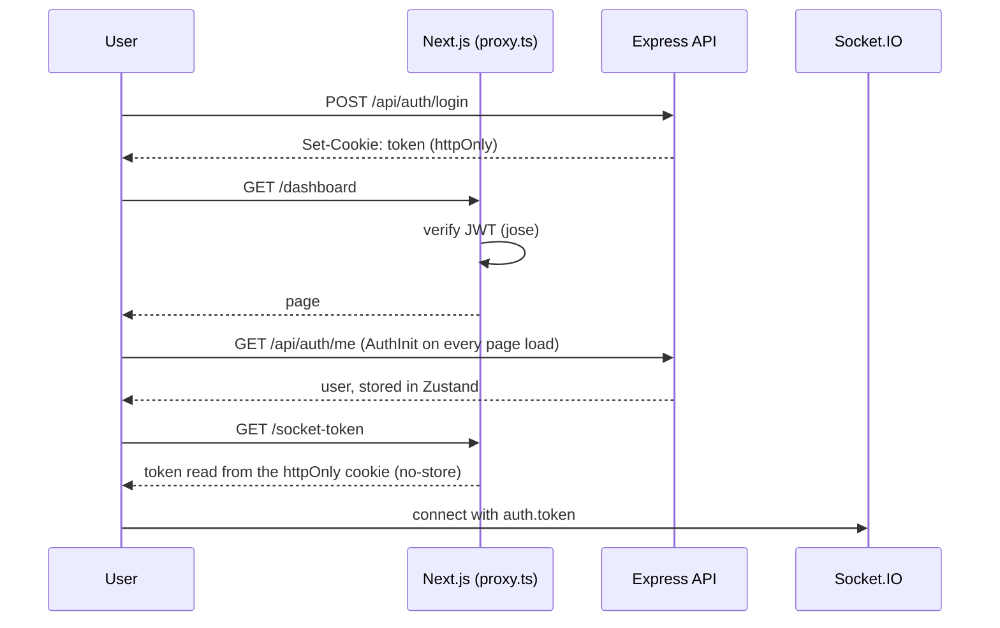

# SyncEdit Frontend

The web client for [SyncEdit](../README.md): a Next.js (App Router) application containing the dashboard, the collaborative Monaco editor, team chat, presence, notifications and the WebRTC video huddle.


## Contents

- [Feature Status](#feature-status)
- [Tech Stack](#tech-stack)
- [Folder Structure](#folder-structure)
- [Routing](#routing)
- [Authentication Flow](#authentication-flow)
- [Data Fetching & State](#data-fetching--state)
- [Real-time Hooks](#real-time-hooks)
- [The Editor in Detail](#the-editor-in-detail)
- [Workspace UI](#workspace-ui)
- [Styling & Theming](#styling--theming)
- [Error Handling & Observability](#error-handling--observability)
- [Environment Variables](#environment-variables)
- [Running Locally](#running-locally)
- [Known Limitations & Roadmap](#known-limitations--roadmap)

## Feature Status

| Area                                                                         | Status                                           |
| ---------------------------------------------------------------------------- | ------------------------------------------------ |
| Register / login / logout, protected routes                                  | Done                                             |
| Dashboard with project list, stats and activity (parallel routes)            | Done                                             |
| Create project and invite collaborators (intercepting-route modals)          | Done                                             |
| Accept invite by link (`/invite/[token]`)                                    | Done                                             |
| Monaco editor with live Yjs sync, remote cursors, autosave                   | Done                                             |
| Shared file explorer (create, rename, delete, context menu)                  | Done                                             |
| Team chat with typing indicators and history                                 | Done                                             |
| Presence, notification bell                                                  | Done                                             |
| Video/audio huddle (WebRTC mesh) with mic / camera toggles                   | Done                                             |
| Dark / light theme                                                           | Done                                             |
| AI assistant panel                                                           | UI only, no backend yet                          |
| Admin area, project settings, teams / reports / revenue / subscription pages | Scaffolded, static content                       |
| Drag-and-drop moving of files between folders                                | Not implemented (drag handlers are placeholders) |

## Tech Stack

| Concern       | Choice                                                                     |
| ------------- | -------------------------------------------------------------------------- |
| Framework     | Next.js App Router, React, TypeScript                                      |
| Editor        | `@monaco-editor/react` (VS Code's editor)                                  |
| Collaboration | `yjs` (CRDT), `socket.io-client`                                           |
| Video         | `simple-peer` (WebRTC), signalling over Socket.IO                          |
| Server state  | TanStack Query (with SSR hydration) and its devtools                       |
| Client state  | Zustand (auth, notifications)                                              |
| Styling       | Tailwind CSS v4 (`@theme` design tokens), `clsx` + `tailwind-merge` (`cn`) |
| UX            | `next-themes`, `motion`, `react-hot-toast`, `lucide-react`, `react-icons`  |
| Edge auth     | `jose` (JWT verification in `proxy.ts`)                                    |

## Folder Structure

```
frontend/src/
├── app/                                  # routes (App Router)
│   ├── (public)/                         # landing, about, auth, legal, pricing
│   │   └── (auth)/{login,register}/
│   ├── (user)/
│   │   ├── (dash)/                       # dashboard shell with parallel + intercepting routes
│   │   │   ├── @stats  @projects  @activity  @modal
│   │   │   └── dashboard, projects, groups, reports, revenue, teams
│   │   ├── editor/[projectId]/           # editor page (server prefetch + hydration)
│   │   ├── invite/[token]/               # accept an invite link
│   │   └── projects/[projectId]/
│   │       ├── _session/                 # ProjectSessionProvider (shared socket + WebRTC)
│   │       ├── workspace/                # IDE workspace and its dock panels
│   │       ├── @modal/(.)invite/         # invite dialog as an intercepting route
│   │       └── settings/
│   ├── admin/                            # admin area (scaffolded)
│   ├── socket-token/route.ts             # hands the httpOnly JWT to the socket handshake
│   └── layout.tsx, globals.css
├── components/                           # dashboard widgets, IDELayout, modals, UI primitives
├── features/
│   ├── auth/                             # authStore (Zustand), authApi (TanStack mutations), AuthInit
│   └── project/                          # projectApi (invite, accept, members), types
├── hooks/                                # useSocket, useProject
├── services/                             # feature modules (UI + hooks together)
│   ├── editor/                           # EditorTab, EditorGroup, FileTree, FileNode, StatusBar, useYjsSync, useFileTree
│   ├── chat/                             # LiveChat, useChatSocket
│   ├── stream/                           # VideoChat, useWebRTC
│   └── notifications/                    # NotificationBell, useNotificationSocket
├── shared/                               # Navbar, Sidebar, Footer, Tooltip, ThemeToggle, providers
├── lib/                                  # socket singleton, userColor, cn
├── types/                                # shared TypeScript types
├── proxy.ts                              # edge auth + project-access gate
├── instrumentation.ts                    # env validation + server error logging
└── instrumentation-client.ts             # client error and navigation logging
```

The `services/` folders follow a **feature-module** layout: each feature keeps its components and hooks together instead of splitting by file type.

## Routing

| Route                                                 | Purpose                                                                                                   |
| ----------------------------------------------------- | --------------------------------------------------------------------------------------------------------- |
| `/` , `/about`, `/subscription-plan`, legal pages     | Public marketing pages                                                                                    |
| `/login`, `/register`                                 | Auth forms (signed-in users are redirected to the dashboard)                                              |
| `/dashboard`                                          | Dashboard shell: `@stats`, `@projects`, `@activity` load as **independent parallel routes**               |
| `/projects/createproject` and `/projects/[id]/invite` | Open as **modals over the dashboard** via intercepting routes (`(.)`) but are still valid, shareable URLs |
| `/projects/[projectId]`                               | Project hub                                                                                               |
| `/projects/[projectId]/workspace?panels=team+stream`  | Full IDE workspace; open dock panels are stored in the URL                                                |
| `/editor/[projectId]`                                 | Editor page; the server prefetches project data and hydrates the client                                   |
| `/invite/[token]`                                     | Redeem an email invite                                                                                    |
| `/admin/*`                                            | Admin area (scaffolded)                                                                                   |

**Edge protection (`proxy.ts`)** runs before these routes render:

- `/login` and `/register` redirect to `/dashboard` when the JWT is valid.
- `/dashboard`, `/projects`, `/editor` and `/admin` redirect to `/login` without a valid JWT (verified with `jose`, `HS256`).
- `/editor/[projectId]` additionally calls the backend's `POST /project/check-access`, so non-members are bounced to the dashboard before the page renders.

## Authentication Flow



- The JWT lives in an `httpOnly` cookie, so client JavaScript cannot read it. A tiny route handler (`/socket-token`, `Cache-Control: no-store`) exposes it to the socket handshake of the _signed-in_ user.
- `AuthInit` runs a TanStack Query for `/api/auth/me` on every page and mirrors the result into the Zustand `authStore`, so components read the user synchronously.
- Logout calls the API (which blacklists the token), clears the query cache and store, disconnects the socket and redirects to `/login`.

## Data Fetching & State

| Kind of state          | Tool                                | Examples                                                                 |
| ---------------------- | ----------------------------------- | ------------------------------------------------------------------------ |
| Server state (REST)    | **TanStack Query**                  | `['user']`, `['projects']`, `['project', id]`, `['project-members', id]` |
| Live state (WebSocket) | Custom hooks over one shared socket | file tree, chat, presence, cursors, video                                |
| Global client state    | **Zustand**                         | current user, notifications                                              |
| UI state               | `useState` / `useRef`               | panel sizes, open tabs, dirty flags                                      |

Highlights:

- **SSR prefetch + hydration.** `editor/[projectId]/page.tsx` is a server component: it reads the cookie, prefetches the project into a `QueryClient`, dehydrates it, and wraps the client in `HydrationBoundary`. The editor renders with data on first paint, and `generateMetadata` sets the tab title to the project name (using a `cache()`-memoised fetch, so the request is shared).
- **Sensible caching.** `useProject` uses a 5-minute `staleTime`, keeps previous data while refetching, and does **not retry** on 401 / 403 / 404.
- **Cache invalidation** on mutations (invite, accept invite, login) keeps the project list and member lists fresh.
- **One socket for the whole app** (`lib/socket.ts`). `useSocket` identifies the user once, joins and leaves project rooms on navigation, caches chat history per project, and re-joins automatically after reconnects.
- **`ProjectSessionProvider`** wraps everything under `/projects/[projectId]`, so the socket and the WebRTC session **survive navigation** between the hub and the workspace (a call is not dropped when you change page).

## Real-time Hooks

| Hook                         | Responsibility                                                                                           |
| ---------------------------- | -------------------------------------------------------------------------------------------------------- |
| `useSocket(projectId, user)` | Connection lifecycle, `identify`, `join-project` / `leave-project`, connection flags, chat-history cache |
| `useYjsSync`                 | Binds a Monaco model to a `Y.Text`, exchanges updates, cursors and save events                           |
| `useFileTree(projectId)`     | Live file tree (`file_tree:init` / `update`) and create / rename / delete actions                        |
| `useChatSocket`              | Messages (de-duplicated by id), typing indicators with timeouts, sending                                 |
| `useNotificationSocket`      | Pushes server notifications into the Zustand store that feeds the notification bell                      |
| `useWebRTC(projectId, user)` | Room join / leave, one `simple-peer` per participant, mic / camera state sync                            |

## The Editor in Detail

`EditorTab` renders Monaco (`vs-dark` theme, word wrap on, minimap off) with a language chosen from the file extension, a status bar (line, column, language) and a read-only mode for `view` users.

**How a local edit reaches everyone else** (`useYjsSync`):

1. Monaco's content change updates a per-file `Y.Doc` / `Y.Text`.
2. Updates are **debounced (50 ms)** and sent as a _diff since the last broadcast state vector_ (`Y.encodeStateAsUpdate(doc, lastVector)`), so only new changes travel.
3. Pending changes are **flushed on unmount, file switch and reconnect**, so nothing is lost.
4. Incoming updates are applied with a `'socket'` transaction origin. A guard flag prevents Monaco's programmatic `setValue` from re-triggering sync, dirty state or autosave (**no echo loops**).
5. On opening a file the client sends `request-yjs-state`. If the shared document is still empty, the first client seeds it from the content saved in the database.

**Other behaviour**

- **Autosave:** a 2-second debounce calls `PUT /api/files/content/:id`, then emits `file_saved` so collaborators see a "saved" notification.
- **Remote cursors and selections:** each user gets a stable colour (their id is hashed into a four-colour palette in `lib/userColor.ts`); cursors are removed when someone leaves or disconnects.
- **View-only users:** the editor is read-only and file-tree actions are hidden; the server also rejects their writes with `edit_denied`.
- **File explorer:** nested tree with inline rename (Enter to confirm), right-click context menu, create file / folder, delete, and file-type icons.

## Workspace UI

- The IDE workspace has a file explorer, tabbed editor groups and a **resizable dock** on the right.
- Dock panels: **Team chat**, **Users**, **Video**, and **AI** (placeholder). Which panels are open is encoded in the URL (`?panels=team+stream`), so a layout can be bookmarked or shared.
- Panels can be resized horizontally and vertically, collapsed to a mini rail, and the width is remembered in `localStorage`.
- The video panel shows a participant grid with mic and camera toggles.

## Styling & Theming

- **Tailwind CSS v4** with design tokens declared in `@theme` (`--color-background`, `--color-primary`, `--color-muted`, and so on), so colours come from one place.
- **Dark mode** uses the class strategy through `next-themes` (`defaultTheme="system"`, no flash on load), with a `ThemeToggle` in the navbar.
- `cn()` (`clsx` + `tailwind-merge`) is used everywhere for conditional, conflict-free class names.
- Fonts: Geist (UI) and JetBrains Mono (code).

## Error Handling & Observability

- `loading.tsx`, `error.tsx` and `not-found.tsx` at route level, plus skeleton components while data loads.
- `instrumentation.ts` validates required environment variables at boot (it fails fast in production) and logs server-side request errors through `onRequestError`.
- `instrumentation-client.ts` logs uncaught client errors, unhandled promise rejections and route transitions (in development), with a hook ready for an analytics provider.
- API errors are mapped to user-facing toasts via `react-hot-toast`.

## Environment Variables

Create `frontend/.env.local`:

| Variable                 | Required | Example                     | Description                                               |
| ------------------------ | -------- | --------------------------- | --------------------------------------------------------- |
| `NEXT_PUBLIC_BASE_API`   | yes      | `http://localhost:5000/api` | Backend REST base URL (used by the server and `proxy.ts`) |
| `NEXT_PUBLIC_SOCKET_URL` | yes      | `http://localhost:5000`     | Socket.IO server URL                                      |
| `JWT_SECRET`             | yes      | same as backend             | Used by `proxy.ts` to verify the JWT at the edge          |

> `NEXT_PUBLIC_*` values are inlined into the browser bundle **at build time**. In Docker / Kubernetes, pass them as build arguments (see the [root README](../README.md#run-on-kubernetes-minikube--kind)).

## Running Locally

```bash
cd frontend
bun install            # or npm install / pnpm install
bun run dev            # http://localhost:3000
```

```bash
bun run build          # production build
bun run start          # serve the production build
```

The backend must be running (see the [backend README](../backend/README.md)). Several calls use relative `/api/...` URLs, so make sure `/api` is proxied to the backend in development (for example with a Next.js `rewrites` rule to `http://localhost:5000/api`); in Kubernetes the ingress does this.

## Known Limitations & Roadmap

**Features**

- [ ] Connect the **AI assistant** panel to a backend endpoint (the UI already listens for responses).
- [ ] Build out the **admin** area. Route gating exists in `proxy.ts`, but it reads a `role` claim that the backend does not put in the JWT yet, so `/admin/*` currently redirects everyone to the dashboard.
- [ ] Wire the project hub's member list and inline invite form to the real members API (the invite _modal_ is already connected).
- [ ] Implement **drag-and-drop file moves** (needs a move endpoint and tree event).
- [ ] Project settings page; real data for teams, reports, revenue and subscription pages.

**Editor**

- [ ] Replace the full-text rewrite in the Monaco ↔ Y.Text binding with an incremental, diff-based binding (as in `y-monaco`) to preserve intent under heavy concurrent typing.
- [ ] Keep Yjs state in sync across multiple backend replicas (needs server-side persistence; see the backend roadmap).

**Code health**

- [ ] Consolidate the two workspace entry points (`/editor/[projectId]` and `/projects/[projectId]/workspace`) into one.
- [ ] Remove leftovers (`ReduxComponent.tsx`, `Temppage.tsx`) and make product naming consistent (some page titles still say "LC-Collab").
- [ ] Add component tests (React Testing Library) and end-to-end tests for the two-user editing flow (Playwright).
- [ ] Accessibility pass (focus management in modals, keyboard navigation in the file tree, ARIA labels on icon buttons).

---

Back to the [main README](../README.md) · [Backend README](../backend/README.md) · [Kubernetes guide](../k8s/README.md)
