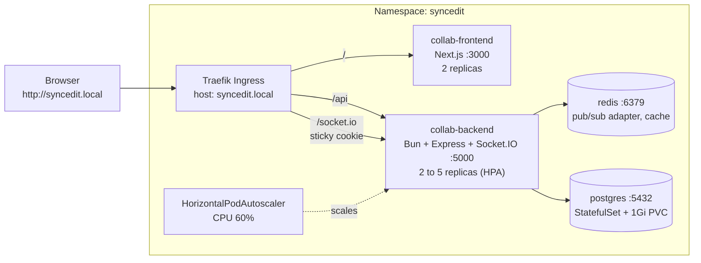

# SyncEdit on Kubernetes

Kubernetes manifests and runbook for deploying [SyncEdit](../README.md) on a local cluster (**minikube**, with a **kind** alternative). The stack is a Traefik ingress in front of a Next.js frontend and a Bun/Express/Socket.IO backend, backed by Redis and PostgreSQL, with CPU-based autoscaling for the backend.


> The public live demo runs separately on Vercel (frontend) + Render (backend) + Neon (PostgreSQL). This folder is the Kubernetes deployment of the same application.

## Contents

- [Architecture](#architecture)
- [What Gets Deployed](#what-gets-deployed)
- [Design Decisions](#design-decisions)
- [Prerequisites](#prerequisites)
- [Backend Readiness Checklist](#backend-readiness-checklist)
- [Deploy on minikube](#deploy-on-minikube)
- [Deploy on kind (alternative)](#deploy-on-kind-alternative)
- [Verify the Deployment](#verify-the-deployment)
- [Autoscaling Demo](#autoscaling-demo)
- [Day-2 Operations](#day-2-operations)
- [Troubleshooting](#troubleshooting)
- [Known Limitations](#known-limitations)
- [Beyond Local: Production Checklist](#beyond-local-production-checklist)
- [Cleanup](#cleanup)

## Architecture



**Routing (single host, path-based):**

| Path         | Service           | Port |
| ------------ | ----------------- | ---- |
| `/socket.io` | `collab-backend`  | 5000 |
| `/api`       | `collab-backend`  | 5000 |
| `/`          | `collab-frontend` | 3000 |

Because the browser talks to **one origin** (`http://syncedit.local`), there are no cross-origin cookies or CORS surprises, and WebSocket traffic goes through the same ingress as everything else.

## What Gets Deployed

| Manifest            | Resources                                                           | Notes                                                                           |
| ------------------- | ------------------------------------------------------------------- | ------------------------------------------------------------------------------- |
| `00-namespace.yaml` | Namespace `syncedit`                                                | Apply first                                                                     |
| `01-config.yaml`    | ConfigMap `syncedit-config`, Secret `syncedit-secret`               | Secret holds **local-dev placeholder values only**                              |
| `02-postgres.yaml`  | Headless Service, StatefulSet (`postgres:16-alpine`), 1 Gi PVC      | Schema loaded from ConfigMap `postgres-init` into `/docker-entrypoint-initdb.d` |
| `03-redis.yaml`     | Deployment (`redis:7-alpine`), Service                              | Persistence **disabled** (`--save "" --appendonly no`)                          |
| `04-backend.yaml`   | Deployment `collab-backend`, Service with sticky-cookie annotations | Init container, probes, rolling update                                          |
| `05-frontend.yaml`  | Deployment `collab-frontend` (2 replicas), Service                  | TCP probes                                                                      |
| `06-ingress.yaml`   | Ingress (`ingressClassName: traefik`)                               | Host `syncedit.local`                                                           |
| `07-hpa.yaml`       | HorizontalPodAutoscaler `collab-backend`                            | 2 to 5 replicas at 60% CPU                                                      |

### Resources

| Workload   | Replicas     | CPU request / limit | Memory request / limit |
| ---------- | ------------ | ------------------- | ---------------------- |
| Backend    | 2 to 5 (HPA) | 100m / 500m         | 128Mi / 512Mi          |
| Frontend   | 2            | 100m / 500m         | 192Mi / 512Mi          |
| PostgreSQL | 1            | 100m / 500m         | 128Mi / 512Mi          |
| Redis      | 1            | 50m / 250m          | 64Mi / 128Mi           |

**Footprint (requests):** about **550m CPU / 832 Mi** at the minimum (2 backend pods), and about **850m CPU / 1.2 Gi** at the maximum (5 backend pods). `minikube start --cpus=2 --memory=4g` leaves comfortable headroom.

## Design Decisions

| Decision                                                                        | Why                                                                                                                               |
| ------------------------------------------------------------------------------- | --------------------------------------------------------------------------------------------------------------------------------- |
| **Traefik instead of Ingress-NGINX**                                            | The Kubernetes project retired Ingress-NGINX in March 2026, so Traefik is the supported choice here.                              |
| **Sticky-session cookie on the backend Service** (`syncedit_route`, `httpOnly`) | Socket.IO may start on HTTP long-polling and upgrade to WebSocket; those requests must reach the same pod.                        |
| **Redis adapter for Socket.IO**                                                 | With more than one backend pod, a message sent to pod A must still reach clients connected to pod B.                              |
| **Resource _requests_ on every container**                                      | The HPA calculates CPU utilisation as a percentage of the request, so it cannot work without them.                                |
| **`RollingUpdate` with `maxUnavailable: 0`, `maxSurge: 1`**                     | New pods must pass readiness before an old one is removed, so deployments do not drop WebSocket capacity.                         |
| **`wait-for-deps` init container**                                              | Backend exits if it cannot reach Postgres at start-up; waiting avoids a crash-loop on cold starts.                                |
| **Readiness and liveness probes on `/health`**                                  | Traffic is only sent to ready pods, and hung pods are restarted.                                                                  |
| **`terminationGracePeriodSeconds: 30`**                                         | Matches the backend's graceful shutdown (it drains HTTP and closes the DB pool on `SIGTERM`, force-exit after 10 s).              |
| **Fast scale-up, slow scale-down**                                              | `scaleUp`: +2 pods every 30 s with no stabilisation; `scaleDown`: 120 s stabilisation, which avoids flapping when load is bursty. |
| **`imagePullPolicy: IfNotPresent` with `:local` tags**                          | Images are built inside the cluster's Docker; a `:latest` tag would force a registry pull that fails.                             |
| **Postgres as a StatefulSet + PVC**                                             | Stable identity and storage that survives pod restarts (use a managed database in the cloud).                                     |

## Prerequisites

[Docker](https://docs.docker.com/get-docker/), [minikube](https://minikube.sigs.k8s.io/docs/start/) (or [kind](https://kind.sigs.k8s.io/)), [kubectl](https://kubernetes.io/docs/tasks/tools/) and [Helm](https://helm.sh/docs/intro/install/).

Run all commands **from the repository root** (the folder containing `backend/`, `frontend/` and `k8s/`).

## Backend Readiness Checklist

What the backend needs to run correctly in a cluster, and where the code stands today:

| Requirement                                 | Status   | Detail                                                                                                         |
| ------------------------------------------- | -------- | -------------------------------------------------------------------------------------------------------------- |
| Health endpoint for probes                  | Done     | `GET /health` and `GET /api/health` return 200                                                                 |
| Listen on all interfaces, port from env     | Done     | Binds `0.0.0.0` on `BASE_PORT` (set to `5000` in the ConfigMap)                                                |
| Graceful shutdown                           | Done     | Handles `SIGINT` / `SIGTERM`, closes HTTP server and DB pool                                                   |
| Conditional DB SSL                          | Done     | `DATABASE_SSL=true` enables certificate-verified SSL; `false` in-cluster                                       |
| Redis adapter for Socket.IO                 | Done     | `@socket.io/redis-adapter` with a duplicated ioredis client                                                    |
| `app.set("trust proxy", 1)`                 | Not set  | Only matters once the app uses `req.ip` / `req.secure` (for example rate limiting or TLS-aware logic)          |
| Shared Yjs / presence state across replicas | **Open** | `Y.Doc`s, presence and video-room state live in each pod's memory, see [Known Limitations](#known-limitations) |

## Deploy on minikube

**1. Start the cluster and enable metrics** (the HPA needs `metrics-server`)

```bash
minikube start --cpus=2 --memory=4g
minikube addons enable metrics-server
```

**2. Install the Traefik ingress controller**

```bash
helm repo add traefik https://traefik.github.io/charts && helm repo update
helm install traefik traefik/traefik -n traefik --create-namespace
```

**3. Build the images inside minikube's Docker daemon**

```bash
# bash / zsh
eval $(minikube docker-env)

# PowerShell (Windows)
# & minikube -p minikube docker-env --shell powershell | Invoke-Expression

docker build -t syncedit-backend:local ./backend
docker build -t syncedit-frontend:local ./frontend \
  --build-arg NEXT_PUBLIC_BASE_API=http://syncedit.local/api \
  --build-arg NEXT_PUBLIC_SOCKET_URL=http://syncedit.local
```

> `NEXT_PUBLIC_*` variables are inlined into the browser bundle **at build time**, so they must be passed as build args (and the frontend `Dockerfile` must declare matching `ARG`s). The Deployment also sets them at runtime, which the server-side code (`proxy.ts`, server components) reads.

**4. Apply the manifests** (order matters: namespace, then the schema ConfigMap, then everything else)

```bash
kubectl apply -f k8s/00-namespace.yaml
kubectl -n syncedit create configmap postgres-init --from-file=backend/postgresqlStructure.sql
kubectl apply -f k8s/
```

**5. Expose the app**

```bash
# in a separate terminal, and keep it open
minikube tunnel
```

Add this line to your hosts file (Linux/macOS: `/etc/hosts`; Windows: `C:\Windows\System32\drivers\etc\hosts`, edit as Administrator):

```
127.0.0.1 syncedit.local
```

If `kubectl -n traefik get svc traefik` shows a different `EXTERNAL-IP`, use that IP instead. Then open **http://syncedit.local**.

## Deploy on kind (alternative)

<details>
<summary>Expand the kind steps</summary>

kind has no `minikube tunnel` or `docker-env`, so: map a host port to Traefik, load images with `kind load`, and give `metrics-server` the `--kubelet-insecure-tls` flag.

```bash
# 1. cluster with port 80 mapped to a Traefik NodePort
cat <<'EOF' > kind-config.yaml
kind: Cluster
apiVersion: kind.x-k8s.io/v1alpha4
nodes:
  - role: control-plane
    extraPortMappings:
      - containerPort: 30080
        hostPort: 80
        protocol: TCP
EOF
kind create cluster --name syncedit --config kind-config.yaml

# 2. Traefik as NodePort
helm repo add traefik https://traefik.github.io/charts && helm repo update
helm install traefik traefik/traefik -n traefik --create-namespace \
  --set service.type=NodePort --set ports.web.nodePort=30080

# 3. metrics-server for the HPA
kubectl apply -f https://github.com/kubernetes-sigs/metrics-server/releases/latest/download/components.yaml
kubectl -n kube-system patch deployment metrics-server --type=json \
  -p '[{"op":"add","path":"/spec/template/spec/containers/0/args/-","value":"--kubelet-insecure-tls"}]'

# 4. build locally, then load into the cluster
docker build -t syncedit-backend:local ./backend
docker build -t syncedit-frontend:local ./frontend \
  --build-arg NEXT_PUBLIC_BASE_API=http://syncedit.local/api \
  --build-arg NEXT_PUBLIC_SOCKET_URL=http://syncedit.local
kind load docker-image syncedit-backend:local syncedit-frontend:local --name syncedit

# 5. apply the manifests (same as minikube)
kubectl apply -f k8s/00-namespace.yaml
kubectl -n syncedit create configmap postgres-init --from-file=backend/postgresqlStructure.sql
kubectl apply -f k8s/
```

Add `127.0.0.1 syncedit.local` to your hosts file and browse to **http://syncedit.local** (no tunnel needed). Clean up with `kind delete cluster --name syncedit`.

</details>

## Verify the Deployment

```bash
kubectl -n syncedit get pods,svc,ingress,hpa
```

Expected: every pod `Running` and `1/1 Ready`, the Ingress listing `syncedit.local`, and the HPA showing a CPU target (not `<unknown>`).

```bash
# which backend pod serves which user
kubectl -n syncedit logs -l app=collab-backend --prefix -f

# direct health check, bypassing the ingress
kubectl -n syncedit port-forward svc/collab-backend 5000:5000
curl http://localhost:5000/health
```

**Functional test:** open the app in two browsers (one incognito), register two users, share a project, and edit the same file. Text, cursors, chat and presence should sync live.

## Autoscaling Demo

```bash
# terminal 1: watch the HPA
kubectl -n syncedit get hpa -w

# terminal 2: generate load (start 2-3 of these with different names if CPU stays low)
kubectl -n syncedit run load1 --rm -it --image=busybox:1.36 --restart=Never -- \
  sh -c 'while true; do wget -q -O- http://collab-backend:5000/health >/dev/null; done'
```

What you should see:

| Phase       | Behaviour                                                                        |
| ----------- | -------------------------------------------------------------------------------- |
| Load starts | `TARGETS` climbs above `60%`                                                     |
| Scale-up    | `REPLICAS` grows by up to 2 pods every 30 s, capped at 5                         |
| Load stops  | `TARGETS` drops; after the 120 s stabilisation window, replicas shrink back to 2 |

Check `kubectl -n syncedit get pods -l app=collab-backend -w` in a third terminal to watch pods being created and removed.

## Day-2 Operations

**Redeploy after changing code.** The image tag stays `:local`, so Kubernetes will not notice a new image on its own. Rebuild inside the cluster's Docker, then restart:

```bash
eval $(minikube docker-env)                       # same shell as the build
docker build -t syncedit-backend:local ./backend
kubectl -n syncedit rollout restart deploy/collab-backend
kubectl -n syncedit rollout status deploy/collab-backend
```

(For the frontend, use `deploy/collab-frontend`; for kind, run `kind load docker-image ...` before restarting.)

**Change configuration.** Edit `01-config.yaml`, `kubectl apply -f k8s/01-config.yaml`, then `rollout restart` the backend (env vars are read at pod start).

**Inspect the data stores**

```bash
# PostgreSQL
kubectl -n syncedit exec -it postgres-0 -- psql -U rajeusr -d livecode -c '\dt'

# Redis (access cache, token blacklist, pending invites)
kubectl -n syncedit exec -it deploy/redis -- redis-cli --scan --pattern '*'
```

**Run a single backend replica** (handy for demos that need guaranteed state consistency, see [Known Limitations](#known-limitations)). `kubectl scale` would be overridden by the HPA, so pin the HPA instead:

```bash
kubectl -n syncedit patch hpa collab-backend --patch '{"spec":{"minReplicas":1,"maxReplicas":1}}'
# restore autoscaling
kubectl -n syncedit patch hpa collab-backend --patch '{"spec":{"minReplicas":2,"maxReplicas":5}}'
```

## Troubleshooting

| Symptom                                 | Likely cause and fix                                                                                                                                                                                                                                                                          |
| --------------------------------------- | --------------------------------------------------------------------------------------------------------------------------------------------------------------------------------------------------------------------------------------------------------------------------------------------- |
| `ErrImagePull` / `ImagePullBackOff`     | The image is not inside the cluster. Re-run `eval $(minikube docker-env)` in the **same shell** and rebuild (minikube), or `kind load docker-image ...` (kind).                                                                                                                               |
| HPA shows `TARGETS <unknown>/60%`       | `metrics-server` is missing or still starting. Run `minikube addons enable metrics-server` (kind: install with the `--kubelet-insecure-tls` patch) and wait a minute. Also confirm the Deployment sets CPU **requests**.                                                                      |
| `syncedit.local` does not load          | `minikube tunnel` is not running, the hosts entry is missing, or it points to the wrong IP (compare with `kubectl -n traefik get svc traefik`).                                                                                                                                               |
| Backend pods stuck in `Init:0/1`        | The `wait-for-deps` init container is waiting for Postgres or Redis. Check `kubectl -n syncedit get pods` and the Postgres pod logs.                                                                                                                                                          |
| Backend `CrashLoopBackOff`              | `kubectl -n syncedit logs deploy/collab-backend`. The server exits if it cannot connect to the database, so check `DB_*` values and that the Postgres pod is ready.                                                                                                                           |
| Tables are missing                      | Postgres runs init scripts only on an **empty** data directory. Recreate the volume: `kubectl -n syncedit delete pod postgres-0 && kubectl -n syncedit delete pvc data-postgres-0`, then `kubectl apply -f k8s/` again (or delete the namespace and redo the steps).                          |
| Login works but real-time does not      | Check that `/socket.io` routes to the backend in `06-ingress.yaml`, and that `NEXT_PUBLIC_SOCKET_URL` was set at **build** time.                                                                                                                                                              |
| Real-time connects, then drops or loops | Sticky sessions: confirm the `syncedit_route` cookie is set in the browser (DevTools, Application, Cookies). The cookie is configured by the annotations on the `collab-backend` Service and issued by Traefik; if it is missing, check `kubectl -n syncedit get svc collab-backend -o yaml`. |
| Auth redirects loop                     | `JWT_SECRET` must be identical for the backend and the frontend (both read it from `syncedit-secret`).                                                                                                                                                                                        |
| Port 80 in use / tunnel fails           | Another process holds the port. Stop it, or use `kubectl -n traefik port-forward svc/traefik 8080:80` and browse to `syncedit.local:8080` (then adjust the build args and ConfigMap origins to match).                                                                                        |

## Known Limitations

- **Yjs and presence state are per-pod.** The server keeps each file's `Y.Doc`, plus presence, cursors and video-room membership, in process memory. Socket.IO broadcasts are shared across pods through the Redis adapter, so live edits reach everyone. But a client that joins on a _different pod_ from the editors may receive an incomplete initial document or presence list. Sticky sessions help only per browser, not per project. Fixing this properly means persisting Yjs updates (Redis or Postgres), moving presence to Redis, or routing each project's room to a single pod. **Test with 2 replicas before claiming horizontal scaling of collaboration**; the HPA demo above scales stateless HTTP load, which is safe.
- **Redis has persistence disabled** (`--save "" --appendonly no`). After a Redis restart, the token blacklist is lost (logged-out tokens become valid again until they expire), and pending email invites are lost. The access cache simply repopulates. Enable AOF or use a managed Redis outside local development.
- **No TLS.** The ingress serves plain HTTP on `syncedit.local`. The ConfigMap sets `NODE_ENV: development`, so cookies are `SameSite=Lax` and not `Secure`. A real deployment needs HTTPS and `NODE_ENV=production`.
- **Secrets are plaintext placeholders** committed in `01-config.yaml`. They exist only for local use.
- **Single Postgres and single Redis** instance; there is no replication or backup.

## Beyond Local: Production Checklist

- [ ] Push versioned images (`:<git-sha>`) to a container registry and remove `imagePullPolicy: IfNotPresent` workarounds
- [ ] Managed PostgreSQL (with backups) and managed Redis; set `DATABASE_SSL=true`
- [ ] Real secrets via Sealed Secrets, External Secrets or your cloud's secret manager
- [ ] TLS with cert-manager (Let's Encrypt), HTTPS-only cookies, `NODE_ENV=production`, `trust proxy`
- [ ] PodDisruptionBudgets for backend and frontend; NetworkPolicies limiting DB/Redis access to the backend
- [ ] Persist Yjs state outside process memory, then load-test with multiple replicas
- [ ] Package as Helm chart or Kustomize overlays (dev / staging / prod) and add a CI/CD pipeline
- [ ] Dashboards and alerts (Prometheus / Grafana) on request rate, WebSocket connections, restarts and HPA activity

## Cleanup

```bash
kubectl delete ns syncedit        # removes every SyncEdit resource, including the Postgres volume
helm uninstall traefik -n traefik # optional
minikube stop                     # or: minikube delete
```

---

Back to the [main README](../README.md) · [Backend README](../backend/README.md) · [Frontend README](../frontend/README.md)
